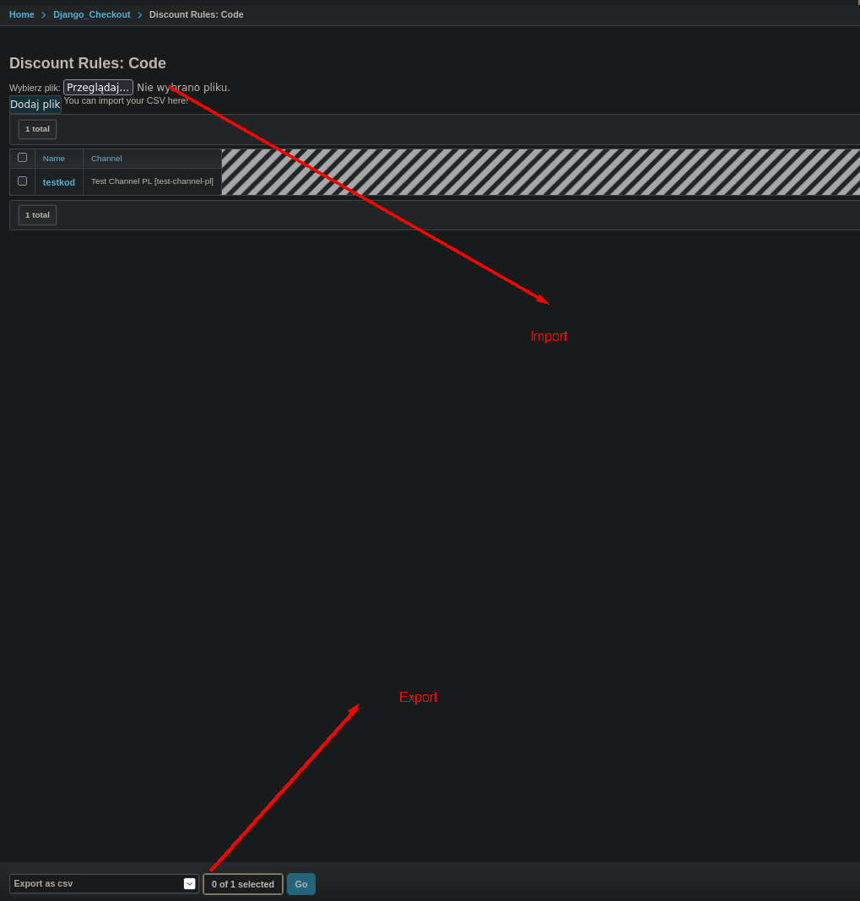

# DISCOUNT
Aby role koszykowe działały poprawnie należy dobrze ustawić pola w DiscountRule:


Aby dodać disocunt do koszyka należy dodać go za pomocą PATCH/POST
Przykład PATCH:

```json
{
    "cart": {
        "items": [
            {"sku": "MAX-36-Czarny", "quantity": 6},
            {"sku": "MAX-38-Czarny", "quantity": 6}
        ],
        "discounts": [
            {"code": "test"}
        ]
    }
}
```

Aby dodać gratis do koszyka należy dodać go za pomocą PATCH/POST. Więcej o gratisach w [gratis.md](gratis.md).
Przykład PATCH:

```json
{
    "cart": {
        "items": [
            {"sku": "MAX-36-Czarny", "quantity": 6},
            {"sku": "MAX-38-Czarny", "quantity": 6}
        ],
        "discounts": [
            {
              "code": "test_step",
              "sku": "demo-120150-403",
              "quantity": 1
            }
        ]
    }
}
```
