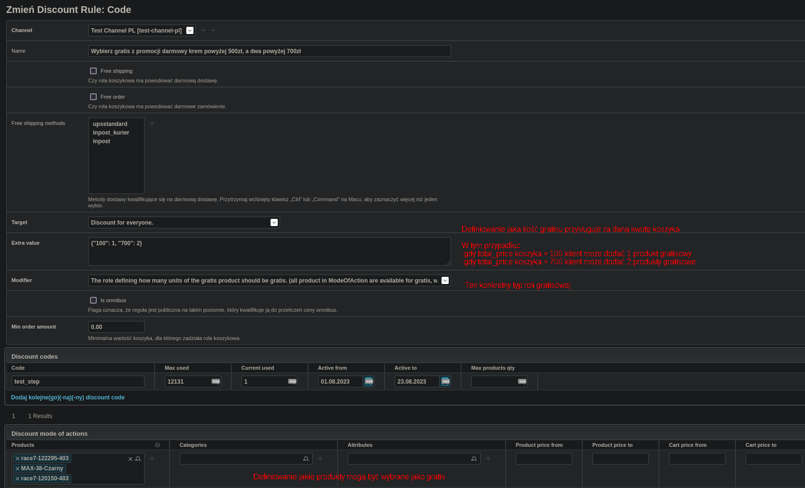
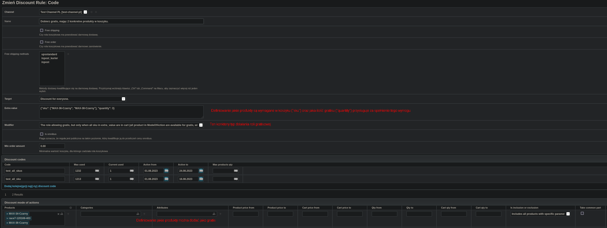

# Dokumentacja gratisów
## Checkout - endpointy
### POST Cart/ Patch Cart

Payload:
Aby uwzględnić gratis w koszyku należy dodać do zapytania w body pole discounts, tak jak w przypadku kodów rabatowych np.:
```json
{
    "cart": {
        "items": [
            {"sku": "MAX-36-Czarny", "quantity": 6},
            {"sku": "MAX-38-Czarny", "quantity": 6}
        ],
        "discounts": [
            {
              "code": "test_step",
              "sku": "demo-120150-403",
              "quantity": 1
            }
        ]
    },
    "language_code": "PL",
    "currency_code": "PLN",
    "country_code": "PL"
}
```
Poza codem roli gratisowej należy też dodać sku oraz ilość jakie wybrał klient na stronie

Response:
Response został rozszerzony o pole data.cart.available_gratis_rules, które zwraca, jeżeli
- jest tylko jeden możliwy gratis - GET All available gratis rules for cart 
```json
    {
        "sku": [
            "demo-122295-403",
            "MAX-38-Czarny",
            "demo-120150-403"
        ],
        "code": "test_step",
        "name": "Wybierz gratis z promocji darmowy krem powyżej 500zł, a dwa powyżej 700zł",
        "price_missing_to_next_gratis_tier": 0,
        "next_gratis_tier_quantity": 0,
        "max_available_quantity": 2
    }
```
- jest więcej niż jeden możliwy gratis - same cody tych gratisów:
```json
["test_step", "test_asd"]
```
aby się dowiedzieć wtedy więcej na temat dostępnych roli gratisowych dla koszyka należy użyć endpointu GET All available gratis rules for cart opisanego poniżej

Dodatkowo po dodaniu gratisu umieszczany jest on tam gdzie wszystkie produkty czyli w polu, liście data.cart.items i powinien mieć on pole is_gratis ustawione na wartość True

np:
```json
{
    "meta": {
        "status": "CREATED",
        "message": "",
        "messages": [],
        "regional": {
            "language": null,
            "currency": null,
            "country": null
        }
    },
    "data": {
        "cart": {
            "items": [
                {
                    "sku": "MAX-36-Czarny",
                    "quantity": "6",
                    "discount_amount": "0.00",
                    "special_from_date": "2019-12-13",
                    "special_to_date": "2029-12-13",
                    "discount_percent": null,
                    "name": "MAX-36-Czarny",
                    "base_unit_price": "590.00",
                    "base_total_price": "3540.00",
                    "special_unit_price": "149.00",
                    "special_total_price": "894.00",
                    "unit_price": "149.00",
                    "total_price": "894.00",
                    "status": "valid",
                    "tax_rate": "0.23",
                    "unit_tax_amount": "27.86",
                    "total_tax_amount": "167.16",
                    "special_percent": 75,
                    "unit_price_netto": "121.14",
                    "total_price_netto": "726.84",
                    "is_gratis": false
                },
                {
                    "sku": "MAX-38-Czarny",
                    "quantity": "6",
                    "discount_amount": "0.00",
                    "special_from_date": "2019-12-13",
                    "special_to_date": "2029-12-13",
                    "discount_percent": null,
                    "name": "MAX-38-Czarny",
                    "base_unit_price": "590.00",
                    "base_total_price": "3540.00",
                    "special_unit_price": "149.00",
                    "special_total_price": "894.00",
                    "unit_price": "149.00",
                    "total_price": "894.00",
                    "status": "valid",
                    "tax_rate": "0.23",
                    "unit_tax_amount": "27.86",
                    "total_tax_amount": "167.16",
                    "special_percent": 75,
                    "unit_price_netto": "121.14",
                    "total_price_netto": "726.84",
                    "is_gratis": false
                },
                {
                    "sku": "demo-120150-403",
                    "quantity": "1",
                    "discount_amount": "989.01",
                    "special_from_date": null,
                    "special_to_date": null,
                    "discount_percent": 99,
                    "name": "Sprężyna gazowa pokrywy silnika MAXGEAR 12-0150",
                    "base_unit_price": "9.99",
                    "base_total_price": "9.99",
                    "special_unit_price": null,
                    "special_total_price": null,
                    "unit_price": "9.99",
                    "total_price": "9.99",
                    "status": "valid",
                    "tax_rate": "0.23",
                    "unit_tax_amount": "2.30",
                    "total_tax_amount": "2.30",
                    "special_percent": null,
                    "unit_price_netto": "7.69",
                    "total_price_netto": "7.69",
                    "is_gratis": true
                }
            ],
            "discount_amount": "989.01",
            "discounts": [
                {
                    "code": "test_step",
                    "sku": "demo-120150-403",
                    "quantity": 1,
                    "item_code": null,
                    "price_discount": 0,
                    "percent_discount": 0,
                    "free_shipping": false,
                    "status": "valid",
                    "free_order": false,
                    "min_order_amount": "0.00",
                    "extra_value": {
                        "100": 1,
                        "700": 2
                    },
                    "target": "all",
                    "modifier": "gratis_stepped"
                }
            ],
            "base_total_price": "7089.99",
            "total_price": "1797.99",
            "validation_status": "valid",
            "total_netto_price": "1453.68",
            "tax_amount": "334.32",
            "available_gratis_rules": [
                "test_step",
                "test_asd"
            ]
        },
        "addresses": null,
        "payment_method": null,
        "shipping_method": null,
        "total_to_min_order_price": null,
        "base_total": "7089.99",
        "total": "1797.99",
        "fee_price": "0",
        "total_tax": "334.32",
        "language_code": "PL",
        "currency_code": "PLN",
        "country_code": "PL",
        "requested_delivery_date": null,
        "custom_order_id": null,
        "comment": null,
        "validation_status": "invalid",
        "cart_id": "81d48490-79bc-4f43-94a7-eac750e164c5",
        "cart_status": "new",
        "free_shipping": true,
        "amount_required_for_free_shipping": "100.00",
        "amount_missing_for_free_shipping": "0.00"
    }
}
```

### GET All available gratis rules for cart

```bash
# Adres:  
/checkout/v1/<channel_idx>/orders/<cart_id>/gratis-rules/
# Przykładowe zapytanie:
curl -X GET /checkout/v1/<channel_idx>/carts/<cart_id>/gratis-rules/
```

Pozwala pobrać dane dotyczące wszystkich możliwych do użycia w koszyku gratisów

>Przykładowa odpowiedź
```json
{
    "meta": {
        "status": "OK",
        "message": "",
        "messages": [],
        "regional": {
            "language": null,
            "currency": null,
            "country": null
        }
    },
    "data": [
        {
            "sku": [
                "demo-122295-403",
                "MAX-38-Czarny",
                "demo-120150-403"
            ],
            "code": "test_step",
            "name": "Wybierz gratis z promocji darmowy krem powyżej 500zł, a dwa powyżej 700zł",
            "price_missing_to_next_gratis_tier": 0,
            "next_gratis_tier_quantity": 0,
            "max_available_quantity": 2
        },
        {
            "sku": [
                "MAX-34-Czarny",
                "demo-120169-403",
                "MAX-36-Czarny"
            ],
            "code": "test_all_skus",
            "name": "Wybierz gratis, mając 3 konkretne kremy w koszyku.",
            "price_missing_to_next_gratis_tier": null,
            "next_gratis_tier_quantity": null,
            "max_available_quantity": 3
        }
    ]
}
```

>Opis obiektu gratisu:

| Field                             | Description                                                                                                                   |
|-----------------------------------|-------------------------------------------------------------------------------------------------------------------------------|
| sku                               | list produktów (sku), które mogą zostać wybrane jako gratis                                                                   |
| code                              | kod gratisu, który należy dodać do koszyka                                                                                    |
| name                              | nazwa roli gratisowej                                                                                                         |
| max_available_quantity            | maksymalna ilość gratisu, która może zostać dodana do koszyka                                                                 |
| price_missing_to_next_gratis_tier | cena, której brakuje do następnego progu gratisowego                                                                          |
| next_gratis_tier_quantity         | ilość gratisu, jeżeli zostanie w koszyku zostanie osiągnięta cena price_missing_to_next_gratis_tier (następny próg gratisowy) |


## Checkout - ustawienia roli gratisowej
Do transferu roli gratisowych można się posłużyć komendami: 
export-discount-rules
import-discount-rules
opisanych tutaj [discount.md](..%2Fcommands%2Fdiscount.md).

Są dwa typy roli gratisowej:
- przyznaj gratis w zależności ile produktów gratisowych należy się za konkretną wartość koszyka
- przyznaj gratis, ale tylko wtedy kiedy koszyk zawiera wszystkie podane w regule sku

Aby skonfigurować pierwszy z nich należy:


extra_value = 
```json
{"100": 1, "700": 2}
```

Aby skonfigurować drugi z nich należy:


extra_value = 
```json 
{"sku": ["MAX-36-Czarny", "MAX-38-Czarny"], "quantity": 3}
```