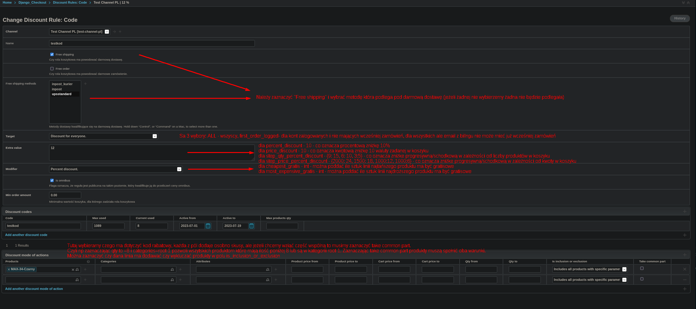

Komenda export-discount-rules
=====================================

Export DiscountRules

Dodano nową komendę:

```bash
manage.py export-discount-rules 
```


params --name - Import discount rules by specified name. You can seperate by ',' Example: socks10,all15
params --channel_idx - Import discount rules by channel_idx. 

Komenda exportuje do pliku CSV informacje o rolach koszykowych.
Plik może znajdować się w `/data/export/discount_rules/discount_rules-20230705-082156/discount_rules.csv` w root volkanos.

Komenda import-discount-rules
=====================================

Import DiscountRules

Dodano nową komendę:

```bash
manage.py import-discount-rules 
```

params file_path - Csv file directory

Komenda importuje z pliku CSV informacje o rolach koszykowych.


You can also import/export in grappelli admin:

